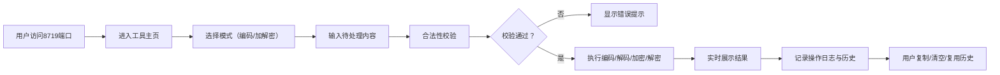

## 1. 产品概述

面向网络开发者的在线编码工具箱，提供字符编码转换、加解密运算服务，运行于8719端口。操作日志与临时数据独立存放，保障开发调试与信息安全场景下的便捷使用。

- 主要用途：快速完成URL、Base64、Unicode等常用格式的编码/解码操作，执行简易对称加密解密
- 目标用户：Web开发工程师、安全测试人员、网络运维人员
- 产品价值：本地服务化工具，无需联网即可高效处理敏感数据，保障数据隐私

## 2. 核心功能

### 2.1 用户角色
| 角色 | 注册方式 | 核心权限 |
|------|----------|----------|
| 本地用户 | 无需注册，本地部署访问 | 使用全部编码解码、加解密功能，查看历史记录 |

### 2.2 功能模块
1. **编码转换模块**：URL编码/解码、Base64编码/解码、Unicode编码/解码、HTML实体编码/解码、Hex编码/解码
2. **加解密模块**：简易对称加密（AES-128-ECB）、解密功能，支持自定义密钥
3. **历史记录模块**：保留操作历史，支持逐条复用、清空历史
4. **操作日志模块**：独立存放操作日志，支持日志查看与清理
5. **工具辅助模块**：一键复制结果、一键清空内容、实时转换预览、合法性校验

### 2.3 页面详情
| 页面名称 | 模块名称 | 功能描述 |
|----------|----------|----------|
| 编码工具主页 | 功能切换区 | Tab切换编码转换/加解密两种模式 |
| 编码工具主页 | 输入输出区 | 左侧文本输入、右侧结果实时展示，支持一键复制、清空 |
| 编码工具主页 | 编码选择区 | URL/Base64/Unicode/HTML/Hex 编码类型选择，一键编码/解码按钮 |
| 编码工具主页 | 加解密操作区 | 密钥输入、加密/解密操作、算法说明提示 |
| 编码工具主页 | 历史记录区 | 历史操作列表展示、单条复用按钮、清空历史按钮 |
| 编码工具主页 | 状态提示区 | 合法性校验结果提示、操作成功/失败反馈 |

## 3. 核心流程

用户访问8719端口进入工具主页 → 选择编码转换或加解密模式 → 在输入区输入待处理内容 → 选择具体编码格式或输入加密密钥 → 点击编码/解码/加密/解密按钮 → 实时展示处理结果 → 可复制结果或复用历史记录 → 操作日志自动记录。

## 4. 用户界面设计

### 4.1 设计风格
- 主色调：深青色 #0F766E 作为主色，搭配琥珀色 #F59E0B 强调色
- 背景：深色科技感渐变背景，带有微妙的网格纹理
- 按钮风格：圆角胶囊形按钮，带有 hover 状态的发光效果
- 字体：JetBrains Mono 作为等宽代码字体，搭配 Inter 作为界面字体
- 布局风格：左右分栏卡片布局，带玻璃拟态效果的面板
- 图标风格：简洁线性图标，使用 lucide-react 图标库

### 4.2 页面设计概述
| 页面名称 | 模块名称 | UI元素 |
|----------|----------|--------|
| 编码工具主页 | 顶部标题区 | 产品Logo、标题、副标题、端口状态指示 |
| 编码工具主页 | 功能切换Tab | 编码转换、加解密 两个选项卡，带动画切换 |
| 编码工具主页 | 输入输出面板 | 双栏布局，输入区与结果区，带标签与操作按钮 |
| 编码工具主页 | 操作按钮区 | 编码格式选择、编码/解码按钮、一键复制、清空 |
| 编码工具主页 | 历史记录侧边栏 | 可折叠历史列表，时间戳+操作类型+内容预览 |
| 编码工具主页 | 状态提示 | Toast消息、错误边框高亮、成功动画 |

### 4.3 响应式设计
- Desktop-first 设计，优先适配 1280px+ 宽屏
- 平板端（768px）：历史记录改为底部抽屉
- 移动端（< 640px）：输入输出改为上下布局，按钮区自适应

