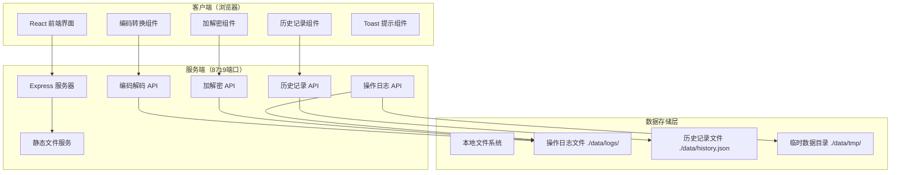
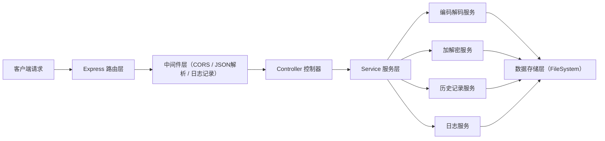
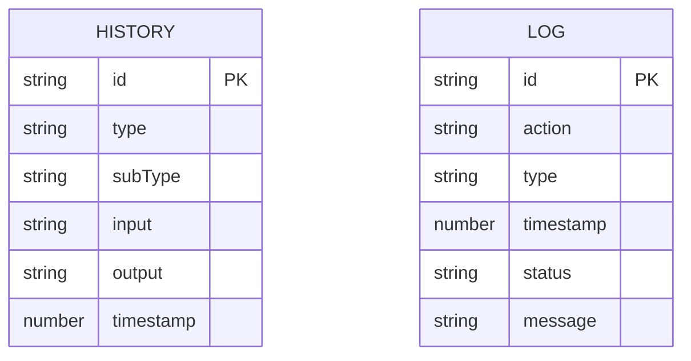

## 1. 架构设计



## 2. 技术描述

- 前端：React@18 + TypeScript + TailwindCSS@3 + Vite@5 + lucide-react
- 初始化工具：npm create vite@latest
- 后端：Express@4 + TypeScript + cors
- 数据存储：本地文件系统（JSON文件存储历史记录，文本文件存储操作日志）
- 加解密库：Node.js 内置 crypto 模块
- 服务端口：8719

## 3. 路由定义

| 路由 | 方法 | 用途 |
|------|------|------|
| / | GET | 前端静态页面 |
| /api/encode | POST | 编码转换接口 |
| /api/decode | POST | 解码转换接口 |
| /api/encrypt | POST | 对称加密接口 |
| /api/decrypt | POST | 对称解密接口 |
| /api/history | GET | 获取历史记录列表 |
| /api/history | POST | 新增历史记录 |
| /api/history | DELETE | 清空历史记录 |
| /api/logs | GET | 获取操作日志 |
| /api/logs | DELETE | 清空操作日志 |

## 4. API 定义

### 编码解码请求
```typescript
interface EncodeDecodeRequest {
  type: 'url' | 'base64' | 'unicode' | 'html' | 'hex';
  content: string;
}

interface EncodeDecodeResponse {
  success: boolean;
  result?: string;
  error?: string;
}
```

### 加解密请求
```typescript
interface EncryptDecryptRequest {
  content: string;
  key: string;
}

interface EncryptDecryptResponse {
  success: boolean;
  result?: string;
  error?: string;
}
```

### 历史记录
```typescript
interface HistoryItem {
  id: string;
  type: 'encode' | 'decode' | 'encrypt' | 'decrypt';
  subType: string;
  input: string;
  output: string;
  timestamp: number;
}

interface HistoryResponse {
  success: boolean;
  data: HistoryItem[];
}
```

### 操作日志
```typescript
interface LogItem {
  id: string;
  action: string;
  type: string;
  timestamp: number;
  status: 'success' | 'error';
  message?: string;
}
```

## 5. 服务器架构图



## 6. 数据模型

### 6.1 数据模型定义



### 6.2 数据存储结构
```
项目根目录/
├── server/
│   ├── src/
│   │   ├── index.ts          # Express 入口
│   │   ├── routes/           # 路由定义
│   │   ├── controllers/      # 控制器
│   │   ├── services/         # 业务逻辑服务
│   │   ├── middleware/       # 中间件
│   │   └── utils/            # 工具函数
│   └── package.json
├── client/
│   ├── src/
│   │   ├── components/       # React 组件
│   │   ├── hooks/            # 自定义 Hooks
│   │   ├── services/         # API 调用
│   │   ├── types/            # TypeScript 类型
│   │   ├── App.tsx
│   │   └── main.tsx
│   └── package.json
└── data/
    ├── history.json          # 历史记录
    ├── logs/                 # 操作日志目录
    │   └── app-YYYYMMDD.log
    └── tmp/                  # 临时数据目录
```

